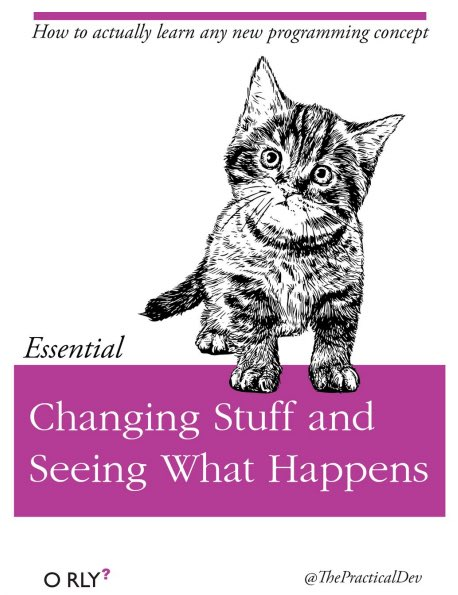

`r if (knitr::is_html_output()) '
# Τake home message {-}
'`

__Kαι τώρα; Τι;__

Το υλικό που καλύπτουμε σε αυτό το demo θα σας δώσει μόνο μία γεύση για το πώς μπορείτε να χρησιμοποιήσετε την R για να αναλύσετε τα δικά σας δεδομένα για τη δική σας έρευνα. Ελπίζουμε μετά από αυτή τη συνεδρία να συνεχίσετε να μαθαίνετε περισσότερα. 

Ο καλύτερος τρόπος για να εξασκηθείτε και να αποκτείσετε εμπειρία στην R, όπως με οποιοδήποτε άλλο εργαλείο ή γλώσσα προγραμματισμού, είναι να το χρησιμοποιήσετε για να απαντήσετε στις πραγματικές σας ερευνητικές ερωτήσεις. Ως αρχάριος, μπορεί να αισθάνεται τρομακτικό να πρέπει να γράψετε ένα σενάριο από το μηδέν, και δεδομένου ότι πολλοί άνθρωποι κάνουν τον κώδικα τους διαθέσιμο στο διαδίκτυο, τροποποιώντας τον υπάρχοντα κώδικα για να ταιριάζει στον σκοπό σας μπορεί να σας διευκολύνει να ξεκινήσετε.

```{r echo=FALSE, , fig.align='center',fig.height=30}

```

Χρήσιμα links:

[R learning resources - η προσωπική μου συλλογή](https://github.com/Eirinits/R_learning_resources/blob/master/README.md)

[Data Carpentry lessons](https://datacarpentry.org/lessons/)

[RStudio Cheatsheets](https://www.rstudio.com/resources/cheatsheets/)
