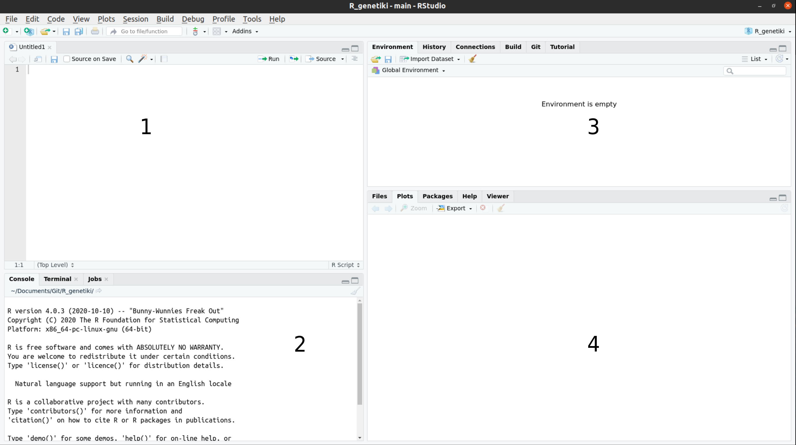

--- 
title: "Εφαρμογές της R στη γενετική"
author: "Eirini Tsirvouli"
date: "`r Sys.Date()`"
site: bookdown::bookdown_site
documentclass: book
bibliography: [book.bib, packages.bib]
biblio-style: apalike
link-citations: yes
description: "Demo για την ημερίδα “Ο προγραμματισμός στη γενετική του ανθρώπου”"
---

# Προετοιμασία {#intro}

Οι συμμετέχοντες καλούνται να εγκαταστήσουν την R και το RStudio πριν την έναρξη του demo. Πρέπει επίσης να είναι να εγκαταστήσουν έναν αριθμό πακέτων R (R packages), να προετοιμάσουν τον κατάλογο εργασίας τους (working directory) και να κατεβάσουν τα αρχεία που θα χρειαστούμε σε αυτό το demo.

Για να αποφύγουμε τυχόν καθυστερήσεις και την αντιμετώπιση προβλημάτων κατά τη διάρκεια του demo, οι συμμετέχοντες θα πρέπει να ακολουθήσουν τις παρακάτω οδηγίες για να κατεβάσουν και να εγκαταστήσουν τα πάντα εκ των προτέρων. Για τυχόν ερωτήσεις, μπορείτε να επικοινωνήσετε μαζί μου μέσω email: eirini.tsirvouli@ntnu.no

**Εγκαταστήστε τα R και RStudio**

Η R και το RStudio είναι δύο ξεχωριστά λογισμικά:

Η R είναι μια γλώσσα προγραμματισμού που είναι ιδιαίτερα ισχυρή για ανάλυση δεδομένων, στατιστικούς υπολογισμούς και γραφικά.
Το RStudio είναι ένα ολοκληρωμένο περιβάλλον ανάπτυξης (IDE) που διευκολύνει τη χρήση της R. Σε αυτό το demο χρησιμοποιούμε το RStudio για να αλληλεπιδράσουμε με την R.
Εάν δεν έχετε ήδη εγκαταστήσει τα R και RStudio, ακολουθήστε τις παρακάτω οδηγίες για το λειτουργικό σας σύστημα. 

:::fyi
Πρέπει να εγκαταστήσετε την R πριν να εγκαταστήσετε το RStudio.
:::

__Windows__

* Κατεβάστε την R από το [CRAN](https://cran.r-project.org/).
* Εκτελέστε το αρχείο .exe 
* Μεταβείτε στη σελίδα λήψης του [RStudio](https://www.rstudio.com/products/rstudio/download/#download)
* Στην ενότητα Installers επιλέξτε RStudio x.yy.zzz - Windows Vista / 7/8/10 (όπου x, y και z αντιπροσωπεύουν αριθμούς έκδοσης)
* Κάντε διπλό κλικ στο αρχείο για να το εγκαταστήσετε
* Μόλις εγκατασταθεί, ανοίξτε το RStudio για να βεβαιωθείτε ότι λειτουργεί και ότι δεν λαμβάνετε μηνύματα σφάλματος.

__MacOS__

* Κατεβάστε την R από το [CRAN](https://cran.r-project.org/).
* Επιλέξτε το αρχείο .pkg για την τελευταία έκδοση R
* Κάντε διπλό κλικ στο ληφθέν αρχείο για να εγκαταστήσετε την R
* Μεταβείτε στη σελίδα λήψης του  [RStudio](https://www.rstudio.com/products/rstudio/download/#download)
* Στην ενότητα Installers επιλέξτε RStudio x.yy.zzz - Mac OS X 10.6+ (64-bit) (όπου x, y και z αντιπροσωπεύουν αριθμούς έκδοσης)
* Κάντε διπλό κλικ στο αρχείο για να εγκαταστήσετε το RStudio
* Μόλις εγκατασταθεί, ανοίξτε το RStudio για να βεβαιωθείτε ότι λειτουργεί και ότι δεν λαμβάνετε μηνύματα σφάλματος.

__Linux__

* Ακολουθήστε τις οδηγίες για τη διανομή σας από το  [CRAN](https://cran.r-project.org/), παρέχουν πληροφορίες για να λάβετε την πιο πρόσφατη έκδοση του R για κοινές διανομές. Για τις περισσότερες διανομές, θα μπορούσατε να χρησιμοποιήσετε τον διαχειριστή πακέτων σας (π.χ., για το Debian / Ubuntu ```run sudo apt-get install r-base``` και για το Fedora ```sudo yum install R```), αλλά δεν συνιστούμε αυτήν την προσέγγιση καθώς οι εκδόσεις που παρέχονται είναι συνήθως ξεπερασμένες. 
* Μεταβείτε στη σελίδα λήψης του  [RStudio](https://www.rstudio.com/products/rstudio/download/#download)
* Στην ενότητα Installers επιλέξτε την έκδοση που ταιριάζει με τη διανομή σας και εγκαταστήστε την με την προτιμώμενη μέθοδο σας (π.χ. με το Debian / Ubuntu  ```sudo dpkg -i rstudio-x.yy.zzz-amd64.deb``` στο terminal).
* Μόλις εγκατασταθεί, ανοίξτε το RStudio για να βεβαιωθείτε ότι λειτουργεί και ότι δεν λαμβάνετε μηνύματα σφάλματος.

## Σύντομη εισαγωγή στο RStudio

### Δημιουργήστε ένα RStudio project
Ένα από τα πρώτα οφέλη που θα εκμεταλλευτούμε στο RStudio είναι κάτι που ονομάζεται RStudio Project, το οποίο σας επιτρέπει να:

* Αποθηκεύστε δεδομένα, αρχεία, μεταβλητές, πακέτα κ.λπ. που σχετίζονται με μία συγκεκριμένη ανάλυση
* Επανεκκινήστε την ανάλυσή σας από εκεί που σταματήσατε
* Συνεργαστείτε, ειδικά αν χρησιμοποιείτε έλεγχο έκδοσης όπως git.

Για να δημιουργήσετε ένα έργο, μεταβείτε στο μενού File και κάντε κλικ στο New project ....
```{r echo=FALSE}
knitr::include_graphics("images/RStudio_project.png")
```

Στο παράθυρο που θα εμφανιστεί επιλέξτε New Directory και, στη συνέχεια, New Project. Για "Directory name:" εισαγάγετε R_genetiki. Η επιλογή "Create project as subdirectory of" ορίζει που θα δημιουργηθεί ο φάκελος που θα περιέχει όλα τα αρχεία του project που μόλις δημιουργήσαμε. Μπορείτε να αφήσετε την προεπιλογή, που είναι ο αρχικός σας προορισμός "~".

Τέλος, κάντε κλικ στο Create project.

### Δημιουργία του πρώτου σας σεναρίου R (R script)

Τώρα που είμαστε έτοιμοι να ξεκινήσουμε την εξερεύνηση της R, θα θέλουμε να διατηρήσουμε ένα αρχείο των εντολών που χρησιμοποιούμε. Για να το κάνουμε αυτό μπορούμε να δημιουργήσουμε ένα σενάριο R:

Κάντε κλικ στο μενού "File" και επιλέξτε "New file" και, στη συνέχεια, R script. Προτού προχωρήσουμε περισσότερο, αποθηκεύστε το σενάριό σας κάνοντας κλικ στο εικονίδιο αποθήκευσης / δίσκου ή κάντε κλικ στο μενού File και επιλέξτε Save. Στο παράθυρο "Save file" που θα εμφανιστεί, ονομάστε το αρχείο σας "r_intro". Το νέο σενάριο r_intro.R θα πρέπει να εμφανίζεται στην καρτέλα Files. 

### H περιβάλλον του RStudio

```{r echo=FALSE}


```


1. Source: Το παράθυρο που εμφανίζονται τα R scripts. Ορισμένα αποτελέσματα (όπως εάν βλέπετε ένα σύνολο δεδομένων χρησιμοποιώντας το View ()) θα εμφανίζονται ως καρτέλα στο ίδιο σημείο.

2. Console / Terminal: Eδώ θα εμφανίζεται στην πραγματικότητα η εκτέλεση των διαφόρων εντολών. Αυτή είναι η ίδια οθόνη που θα βλέπατε αν χρησιμοποιούσατε την R μέσω της γραμμή εντολών, χωρίς το RStudio. Μπορείτε να εργαστείτε διαδραστικά (δηλ. να εισαγάγετε κατευθείαν εντολές R εδώ), αλλά ως επί το πλείστον θα δουλέψουμε εκτελώντας ένα σενάριο (ή γραμμές από ένα σενάριο) στο παράθυρο _"Source"_.

3. Environment / History: Εδώ, το RStudio θα σας δείξει ποια δεδομένων και αντικείμενα (μεταβλητές) έχετε δημιουργήσει. Μπορείτε επίσης να δείτε ορισμένες ιδιότητες αντικειμένων, όπως τον τύπο και τις διαστάσεις τους. Η καρτέλα "Ιστορικό" περιέχει ένα ιστορικό των εντολών R που έχετε εκτελέσει R.

4. Files / Plots / Packages / Help: Αυτό το παράθυρο πολλαπλών χρήσεων θα σας δείξει τα περιεχόμενα των φακέλων στον υπολογιστή σας. Μπορείτε επίσης να χρησιμοποιήσετε την καρτέλα "Αρχεία" για να πλοηγηθείτε και να ορίσετε τον κατάλογο εργασίας (working directory). Η καρτέλα "Plots" θα εμφανίσει τα διάφορα γραφικά που θα δημιουργήσετε. Στην καρτέλα "Packages" θα δείτε ποια πακέτα έχετε εγκατεστειμένα. Η καρτέλα "Ηelp" θα εμφανίσει αρχεία βοήθειας για λειτουργίες και πακέτα R.


### Kατέβασμα απαραίτητων αρχείων και πακέτων

Για το συγκεκριμένο demo θα χρειαστούμε κάποια πακέτα (packages) τα οποία θα μας παρέχουν τις απαραίτητες συναρτήσεις και λειτουργίες (functions). Η εγκατάσταση των πακέτων γίνεται με την εντολή ```install.packages()```, ενώ η φόρτωση του με την εντολή ```library()```. To πρώτο πακέτο περιέχει τις απαραίτητες εντολές που θα χρειαστούμε ώστε να κατεβάσουμε τα αρχεία που θα χρησιμοποιήσουμε σε αυτό το demo. Το πακέτο tidyverse χρησιμοποιείται για το χειρισμό και την προετοιμασία δεδομένων πριν ξεκινήσουμε την ανάλυσή τους.

```{r eval=FALSE}
install.packages(c("readr", "pheatmap")
```

Για να βεβαιωθείτε πως τα πακέτα έχουν εγκατασταθεί σωστά, χρησιμοποιείστε τις παρακάτω εντολές και βεβαιωθέιτε πως δε λαμβάνετε κάποιο σφάλμα.

```{r eval=FALSE}
library(readr)
library(pheatmap)
```

Για να κατεβάσετε τα δεδομένα που θα χρησιμοποιήσουμε σε αυτό το demo, εκτελέστε τις παρακάτω εντολές:

```{r}
url_data <- "https://raw.githubusercontent.com/Eirinits/R_genetiki/main/patient_data.csv"
url_metadata <- "https://raw.githubusercontent.com/Eirinits/R_genetiki/main/metadata.csv"
data <- read.csv(url_data)  
metadata <- read.csv(url_metadata)  
```

```{r include=FALSE}
# automatically create a bib database for R packages
knitr::write_bib(c(
  .packages(), 'bookdown', 'knitr', 'rmarkdown'
), 'packages.bib')
```
